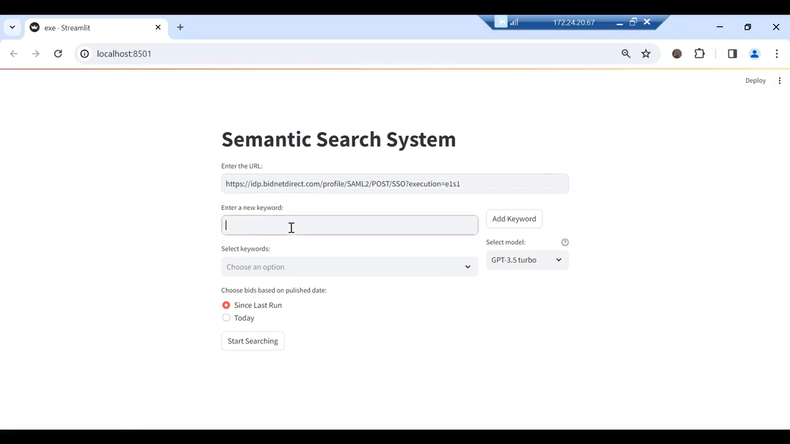

# Semantic Search System

The Semantic Search System is a tool designed to streamline the process of conducting advanced searches using specific keywords on the Bidnet Portal. By leveraging the ChatGPT 3.5 Turbo API, this system enhances the relevance and precision of search outcomes. It incorporates a user-friendly interface built using Streamlit and a robust backend API powered by Flask, along with integration of Automation Anywhere bots with the whole system.

## Key Features

- **User-Friendly Web Interface:** Built with Streamlit, it allows users to input search criteria including website URL and keywords and view results.
- **Robust Backend API:** Developed using Flask to manage data storage, retrieval, and processing efficiently.
- **Automated Bot Deployment:** Facilitates automated content retrieval using Automation Anywhere bots based on user-defined keywords and selected models.
- **Use of LLM's like ChatGPT:** Gives the ability to use models such as ChatGPT 3.5 Turbo API to perform semantic search.

## System Overview

This project is structured into 3 primary components:

1. **Frontend:** A Streamlit application that provides an intuitive interface for users to specify search parameters and display results.
2. **RPA Bots:** Automation Anywhere bots that extract website information and then uses [Semantic_Search_Script](./Semantic_Search_Script.py) to perform Semantic Search and then send the results to Flask through [Request_Script](./Request_Script.py)
3. **Backend:** A Flask application responsible for handling API requests, ensuring efficient data management and search processing.

